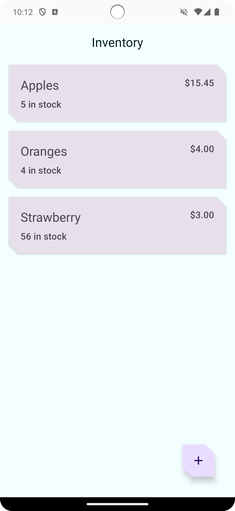
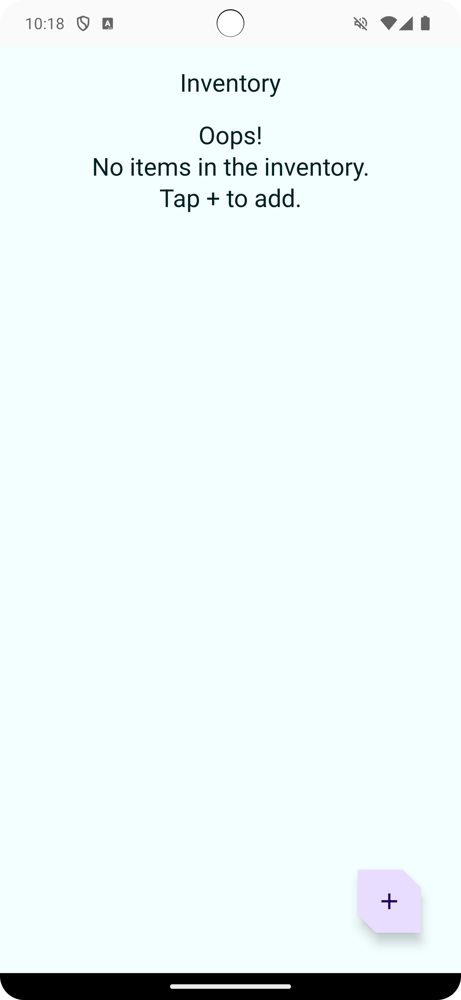
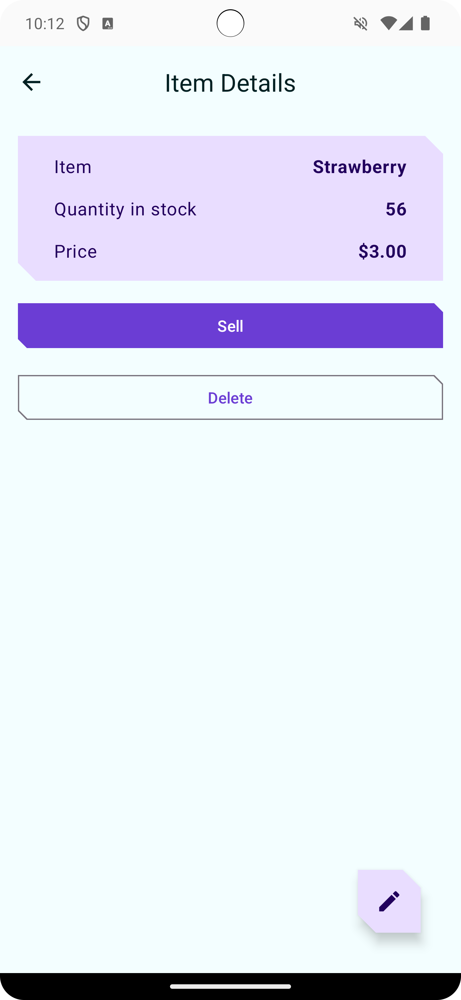
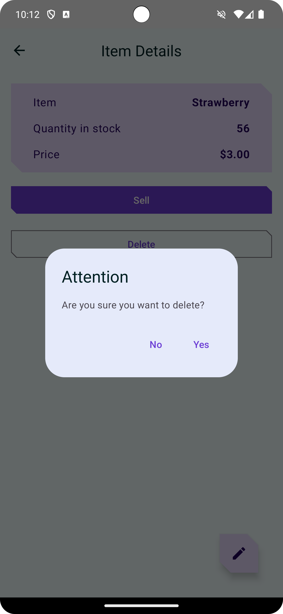
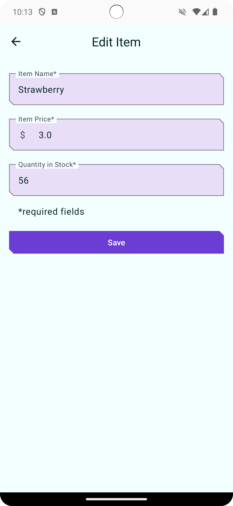
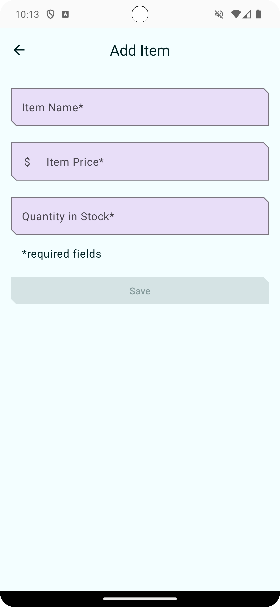

Inventory app
==================================

This app is an Inventory tracking app. Demos how to add, update, sell, and delete items from the local database.
This app demonstrated the use of Android Jetpack component [Room](https://developer.android.com/training/data-storage/room) database.
The app also leverages [ViewModel](https://developer.android.com/topic/libraries/architecture/viewmodel),
[Flow](https://developer.android.com/kotlin/flow),
and [Navigation](https://developer.android.com/topic/libraries/architecture/navigation/).

It's developed using Jetpack Compose components like ```Column```, ```Button```, ```Text```, ```Image```, and ```Modifier```.

<p align="center">
    
    
    
    
    
    
</p>


Getting Started
---------------

1. Download and run the app.
